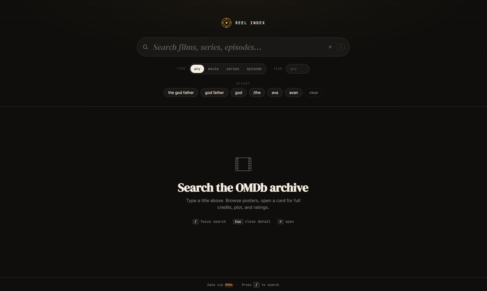
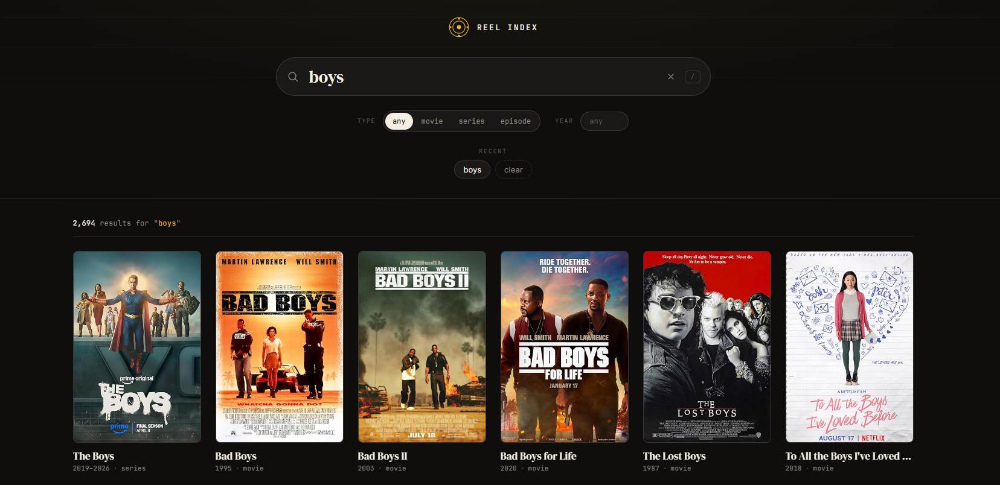
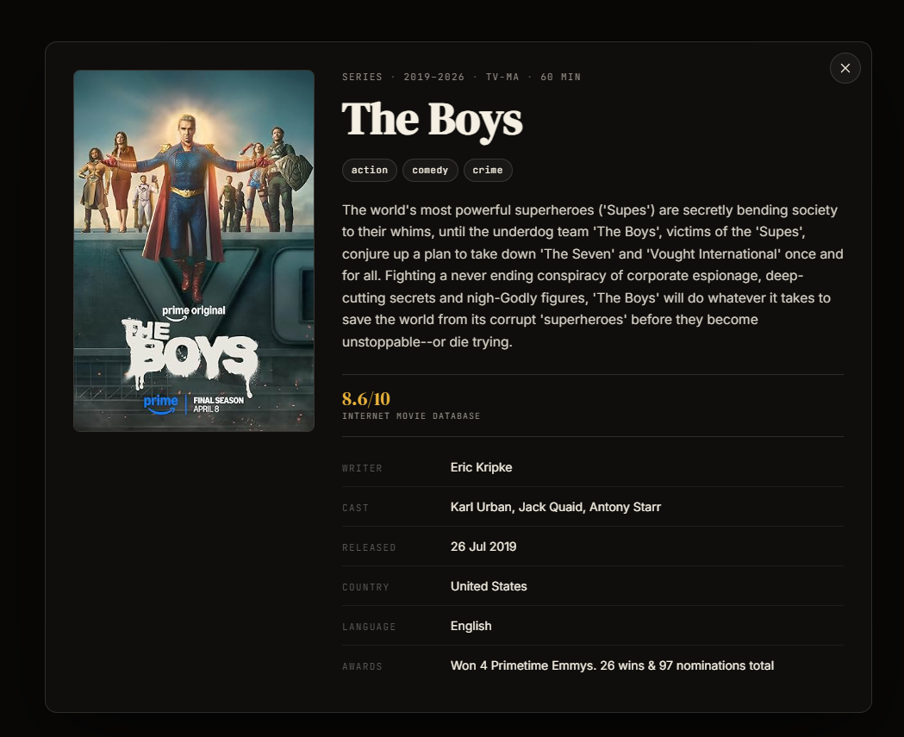

   
  <b>Reel Index</b> 
  <i>A small movie search app built on the OMDb API.</i>

  
  
  

[Live demo](https://inaolol.github.io/omdb-project/)

Note: A free-tier OMDb API key is deliberately included in `config.js` so the live demo works instantly for reviewers. You can use your own key by copying `config.example.js` to `config.js` and updating the value.

## Screenshots

## Features

### Functional
- **Live Search & Filtering:** Debounced input (380 ms) with filters for type (movie / series / episode) and year—no submit button needed.
- **Rich Movie Details:** Browse a responsive grid of posters, click to view an overlay with full plot, ratings (IMDb, Metacritic, Rotten Tomatoes), and credits.
- **Persistent State:** Last search query is restored from the `?q=` URL param (enabling shareable links), and recent searches are saved across visits via `localStorage`.
- **Robust UI States:** Distinct empty, loading (CSS skeleton grid), no-results, and error states with retry/clear actions.
- **Keyboard Navigation:** Use `/` or `⌘K` to focus search, `Esc` to close detail overlays, and `Enter` to open cards.

### Non-functional (Architecture & Performance)
- **Vanilla Tech Stack** Pure HTML/CSS/JS. No framework, no build step, no transpile. Runs natively in any modern browser.
- **Performance Optimized:** `searchToken` discards stale HTTP responses to prevent UI flicker. Poster images are lazy-loaded (`loading="lazy"`), and DOM thrashing is avoided through single `innerHTML` writes per render phase.
- **Maintainable & Testable:** Core URL builders and view-model creators are pure functions isolated from the DOM. `fetch` and document objects are injected, allowing unit tests (`npm test`) to run instantly without a browser.
- **Responsive & Secure:** Fluid layout using CSS Grid (`auto-fill` / `minmax`) for mobile-first design. All user-facing strings are HTML-escaped to prevent XSS injection from API responses.

## Tech decisions

- **Key in repo.** OMDb free-tier keys are rate-limited per-key (1000 req/day) and trivially rotated. A serverless proxy would defeat "static GitHub Pages deploy." If abused, the key gets rotated; nothing else is at risk.
- **State as plain variables in a closure.** No state-management library for ~6 fields. The closure inside `initApp` is the state container.
